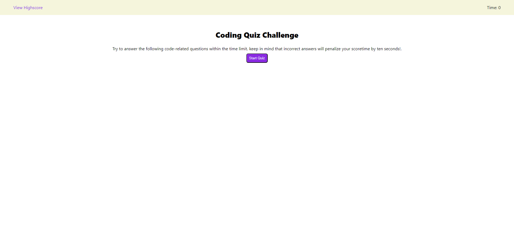
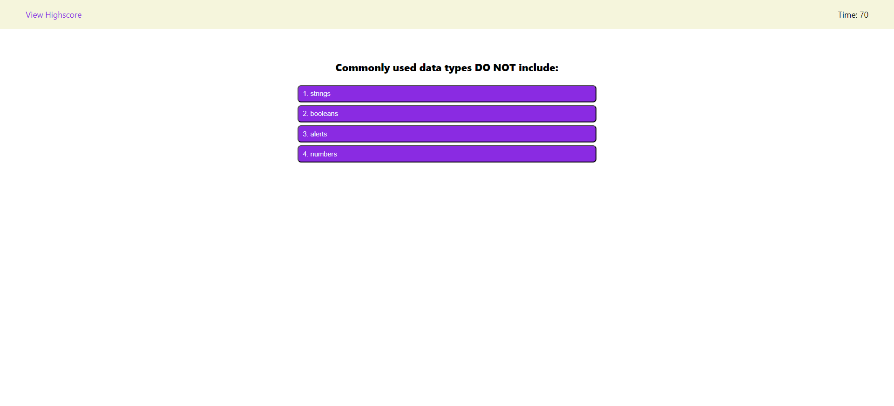
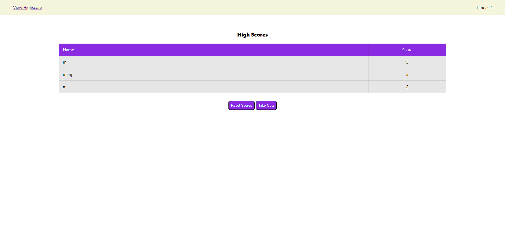
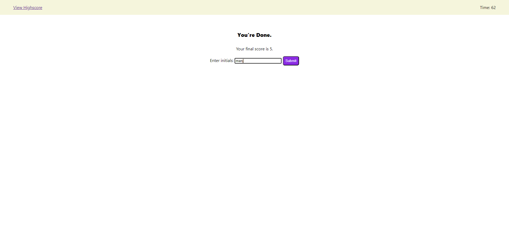

# Manjis-Quiz-Game

## Description
This project is to to build a timed coding quiz with multiple-choice questions. This app will run in the browser and will feature dynamically updated HTML and CSS powered by JavaScript code

## Installation
NA

## Usage

Screenshots from Live site

Application URL: https://manjiniabraham.github.io/Manjis-Quiz-Game/

## Credits

https://developer.mozilla.org/en-US/docs/Web

https://www.w3schools.com/

https://tobiasahlin.com/blog/css/

https://www.youtube.com/watch?v=wKBu_dEaF9E

https://stackoverflow.com/

https://www.youtube.com/watch?v=5fb2aPlgoys

https://www.microverse.org/blog/how-to-loop-through-the-array-of-json-objects-in-javascript

## Features

* The timed quiz has the following features:
	* A start page with a "Start" button to start the quiz
	* About 5 multiple choice questions.
	* Timer to track time reamining for the test. Test should be completed with in 75 sec.
	* Highscores page to display your scores in descending order (highest on top).
	* Reset and Take quiz buttons to reset all scores and take the quiz again respectively.
	* Wrong answers will deduct 10 secs from the time remaining.

